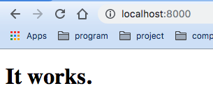

# server

This repository implements http server through socket in go language.

Although the Go language has imbedded http server in net/http package, but I want to implement it by myself. It is so funny to do so. In the development process, I hope that I can think deeply and be more familiar with the network programming.

### Usage

1.  Firstly, install the repository and build the main.go.


    ```bash
    $ go get github.com/lwlwilliam/server
    $ cd $GOPATH/src/github.com/lwlwilliam/server
    $ vim conf/var.go # Change the absolute path of DocumentRoot directory of yourself.
    $ go build main.go
    ```


2.  Start the server.


    ```bash
    $ ./main
    ```
    

    Also, you can specify the host and port with flags. Just like this.


    ```bash
    $ ./main -h host -p port
    ```
    
3.  Communicate with the server.


    
